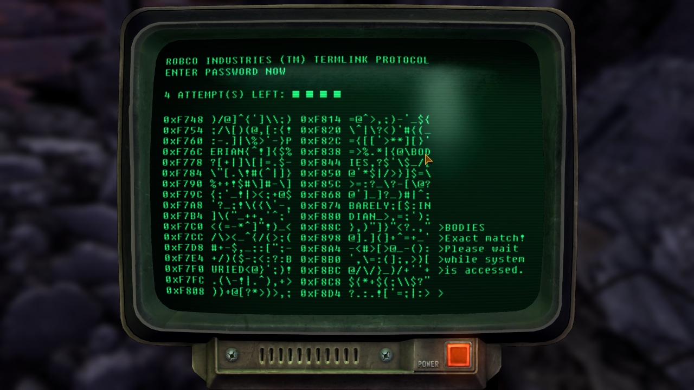

# FalloutOS

## Purpose

I didn't have any goal at the begining of this projet, I just wanted to practice my Rust. Had to learn new things. Learn how a kernel work, to discovery how the memory is handelled on bare metal, how segfault are detected... But I did gave myself some target.

- The code must be in Rust, and avoid assembly or unsafe Rust as much a possible.
- The end product should look like a terminal juste like the one in the video game series "Fallout"



## HowTo
This is written in Rust, so you obviously need to have [rust](https://rustup.rs/) installed.

In order to run this, you need to have installed `qemu`  and `bootimage`.

### Ubuntu
```bash
# apt-get install qemu -y
```

### Fedora
```bash
# dnf install qemu -y
```

### extra Rust setup
```bash
rustup toolchain install nightly
rustup component add rust-src
rustup component add llvm-tools-preview
cargo install bootimage
```

Now you can hit `cargo run`

If a problem occurs, feel free to open an issue. Or to make a PR.
